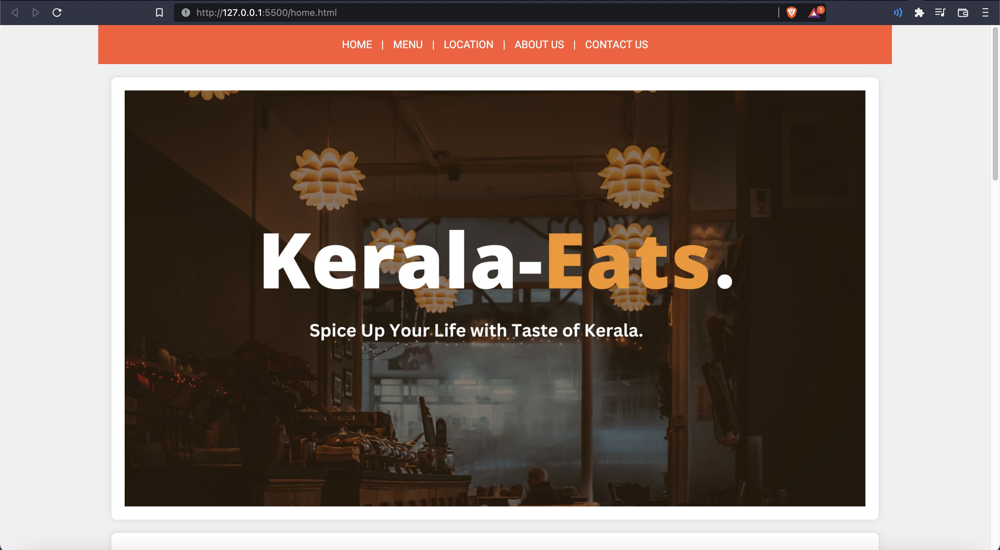
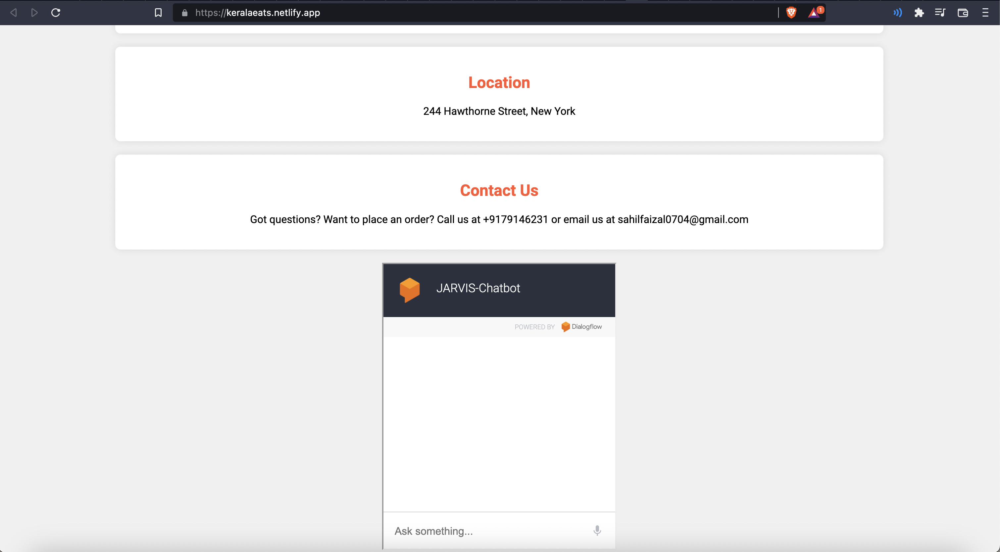
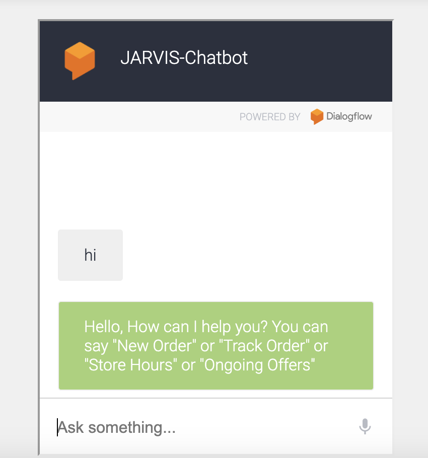
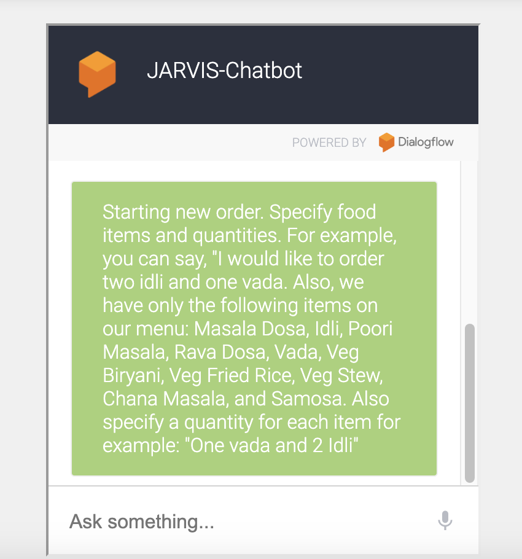
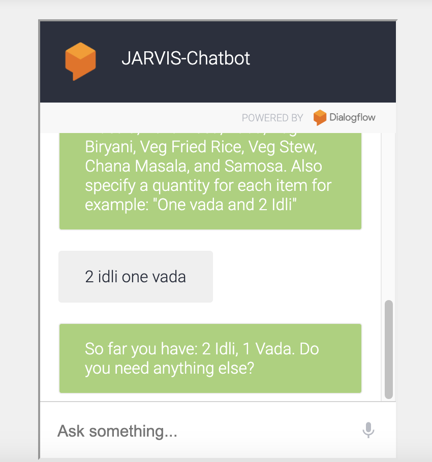
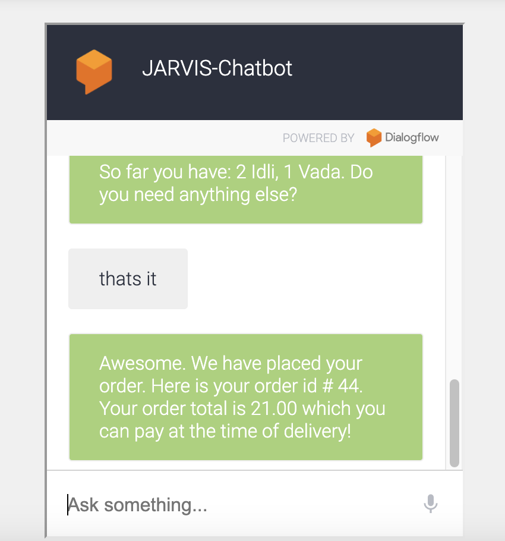
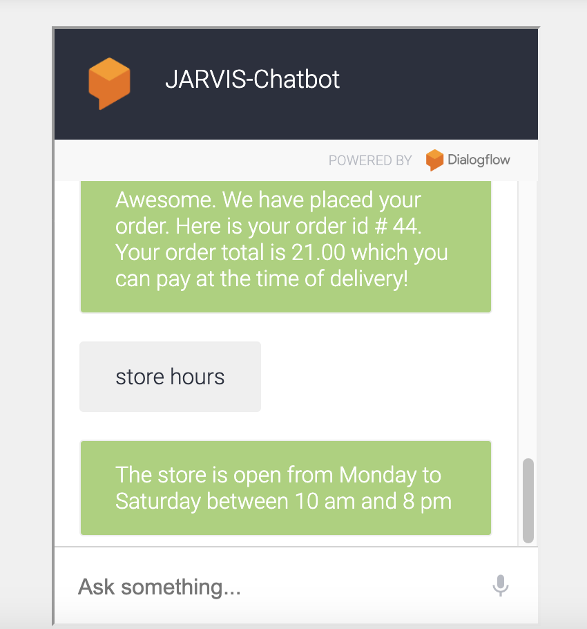
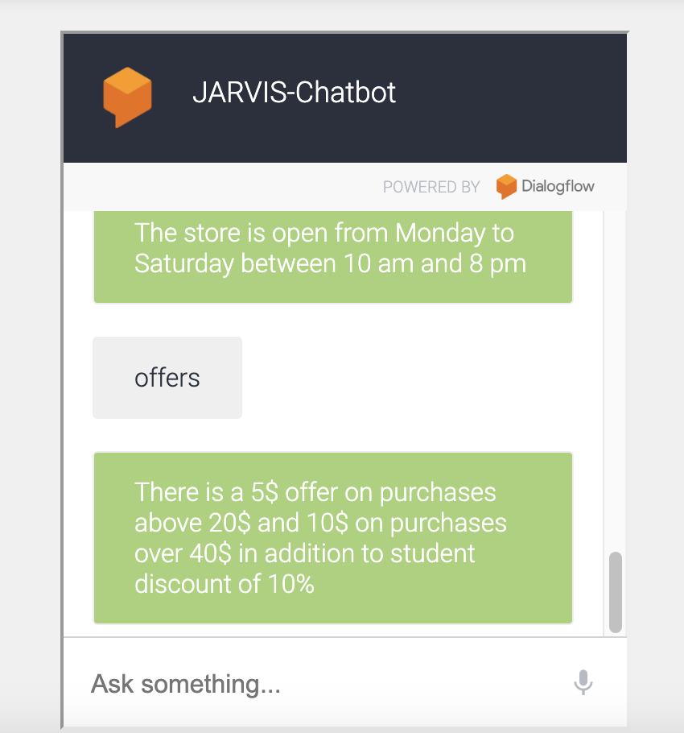

# KeralaEats-Jarvis-ChatBot
#### (Project Management - JIRA, Asna, Notion)
#### Chatbot Platforms - Dialogflow, RASA, Amazon Lex
## IMPORTANCE OF CHATBOT IN E-Commerce
* <b>Enhanced Customer Service:</b> Chatbots can provide immediate responses to customer inquiries, helping users with menu choices, order status, and FAQs. This improves customer satisfaction and loyalty.

* <b>24/7 Availability:</b> Chatbots are available round the clock, allowing customers to place orders and get assistance at any time, even outside of business hours.

* <b>Efficiency:</b> Chatbots streamline the ordering process by guiding users through menu options and taking orders swiftly. This can reduce human errors and enhance order accuracy.

* <b>Cost Savings:</b> Chatbots can handle multiple inquiries simultaneously, reducing the need for extensive customer support staff. This can result in cost savings for 'KeralaEats'.

* <b>Personalization:</b> Chatbots can analyze customer preferences and provide personalized recommendations, increasing the chances of upselling and cross-selling.

* <b>Data Insights:</b> Chatbots collect valuable customer data that can be used for marketing strategies and improving the overall user experience. This data can help 'KeralaEats' understand customer preferences and behaviors.
## WHY DIALOGFLOW?
* <b>Natural Language Processing (NLP):</b> Dialogflow's NLP capabilities allow chatbots to understand and respond to user input in a conversational and human-like manner. It can recognize entities, intents, and contexts, making it easier to build interactive and context-aware chatbots.

* <b>Ease of Use:</b> Dialogflow provides a user-friendly interface and step-by-step guides that make it accessible to developers with varying levels of expertise. You don't need to be an AI expert to get started with building chatbots.

* <b>Integration:</b> Dialogflow offers seamless integration with various platforms, including web and mobile apps, messaging platforms, and voice assistants. This versatility allows developers to create chatbots that can reach users through multiple channels.

* <b>Community and Support:</b> The Dialogflow community is active, providing resources, templates, and solutions to common challenges. Google's support and frequent updates ensure that developers have access to the latest features and improvements.

* <b>Scalability:</b> Dialogflow can handle a wide range of applications, from simple chatbots to complex voice assistants. This scalability makes it suitable for various industries and use cases, from customer support to e-commerce.

* <b>Third-Party Integrations:</b> Dialogflow can be extended with third-party plugins and integrations, allowing you to add custom functionality and connect to external services, databases, and APIs.

## SCOPE OF WORK
### New Order
* Place new order
* Support payment through a chatbot
### Track Order
* track order by phone number
* track order by customer name
* track order by order id
### Offers and Store Hours
* Ongoing offers
* Upcoming offers
* Store hours
## BACKLOG
* Place new order
* Support payment through a chatbot
* track order by phone number
* track order by customer name
* track order by order id
* Ongoing offers
* Upcoming offers
* Store hours
## MVP (Minimum Viable Product)
* Place new order
* Track order by order id
* Store hours
* Ongoing offers
## PHASE 2
* Incorporate payment option
* Upcoming offers

## WEB PORTAL DESIGN

## CHATBOT WORKING
### Starting the conversation

### Requesting for new order

### Specifying order details 

### Placing an order

### Store hours

### Ongoing Offers

